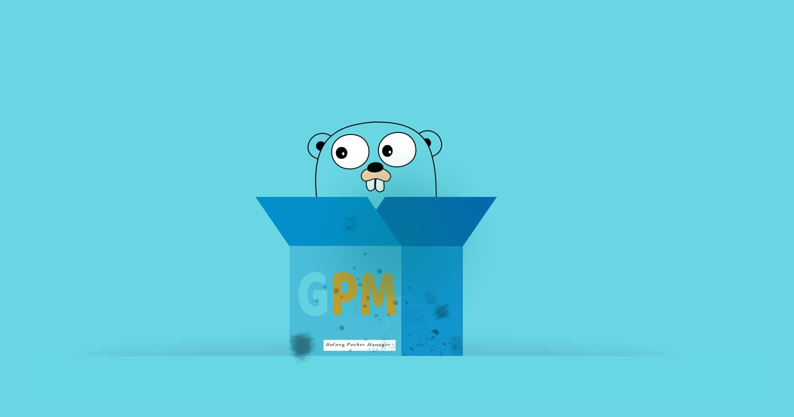

# `GPM` - golang pocket manager



### Пакетный менеджер для создания приложений на языке golang

### Установка

```bash
git clone https://github.com/golangpm/gpm
cd gpm

#Linux
./gpm_linux-setup

# Mac Os
./gpm_mac_setup

```

## Как использовать

[Documentation](./docs/DOCUMENTATION.md)

`gpm` - меню утилиты

`gpm goapp` **MyApp** - создать приложение "MyApp"

`gpm config` - посмотреть конфиг

`gpm set-config` - установить данные пользователя в конфигурацию (github username и email)