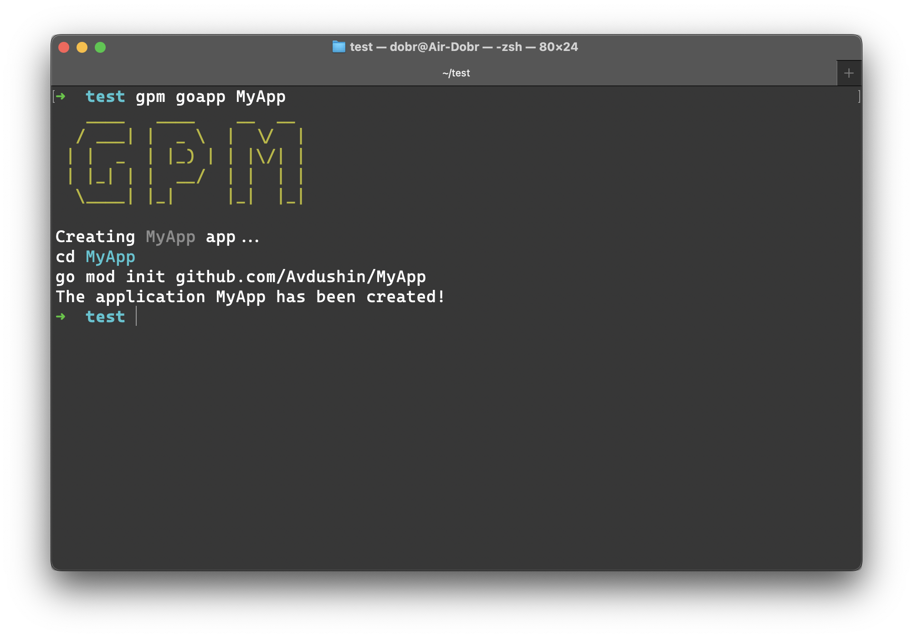
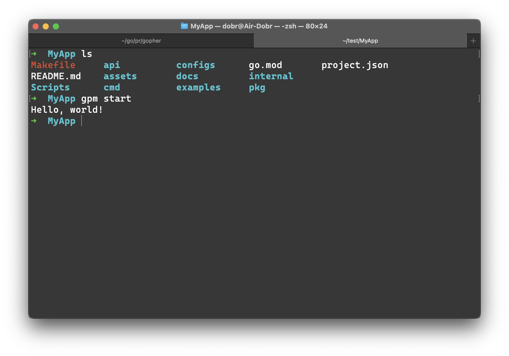
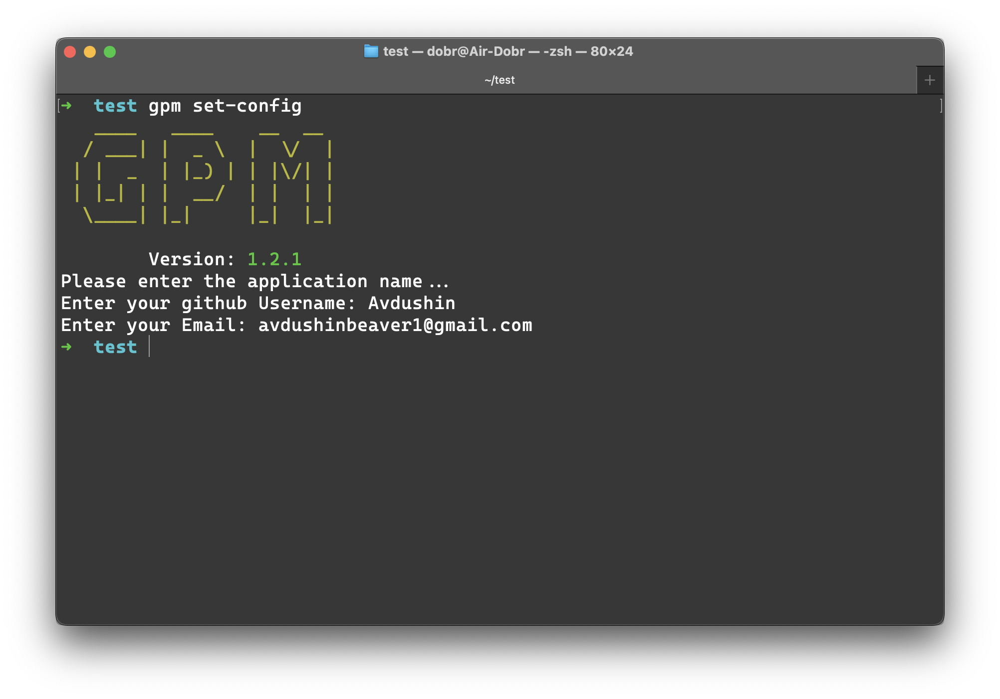
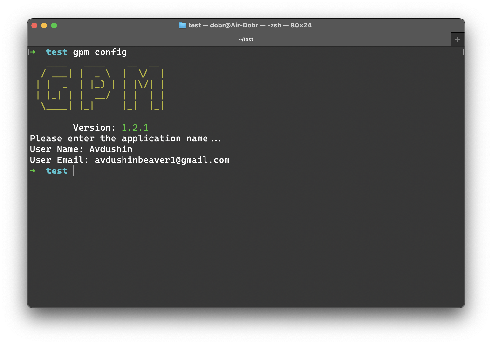
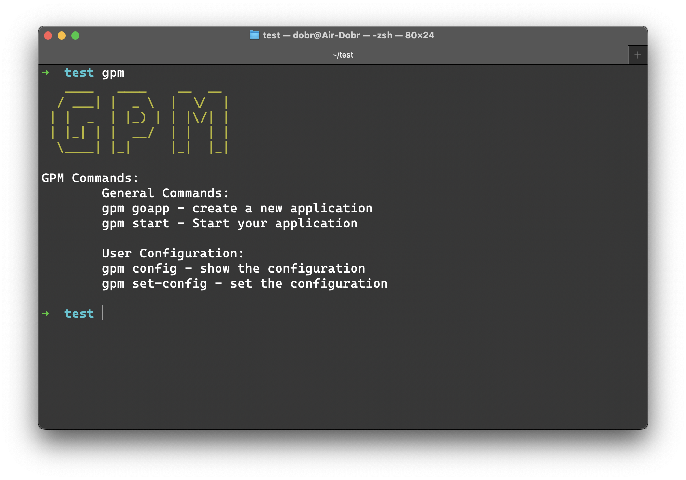
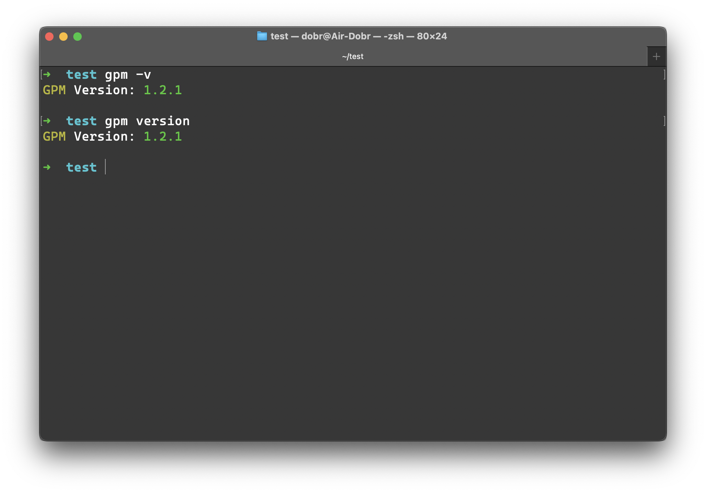

# GPM DOCUMENTATION

## `GPM` - golang pocket manager

### Package manager for creating golang applications   

# FUNCTIONS

## General `gpm` optins

- [goapp](#goapp)
- [start](#start)

## User Configuration

- [config](#config)
- [set-config](#set-config)

## Other

- [gpm](#gpm)

- [version](#version)

 

# General `gpm` optins

## goapp

Use `goapp` function to create a new application

Example usage:

`gpm goapp` MyApp

## start

Use `start` function to start the application

Example usage:

`gpm start`

# Configuration

## set-config

use `set-config` function to set the configuration (Your Email and GitHub Username)

Example usage:

`gpm set-config`

## config

Use `config` function to show the your configuration

Example usage:

`gpm config`

# Advanced

## gpm

Use `gpm` to show help information:

Example usage:

`gpm`

## version

Use `version` function to show current `GPM` version

